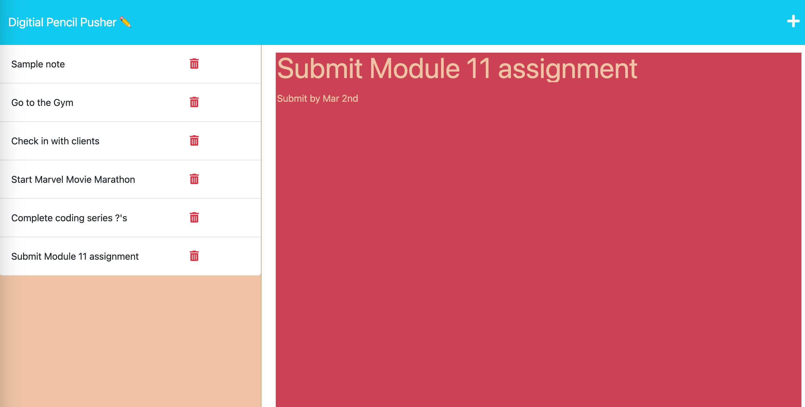

# Digitial Pencil Pusher:  A note-taking application

## Table of Contents

___

* [Deployed](#deployed)
* [Description](#description)
* [Technologies/Languages](#technologieslanguages)
* [Usage](#usage)
* [Screenshot](#screenshot)
* [Questions](#questions)
* [Licenses](#licenses)
* [Credits](#credits)

## Deployed

___
Click [here](https://afternoon-springs-13154.herokuapp.com/) to access the Digital Pencil Pusher application on Heroku.

## Description

___
This application allows the user to write and store notes. The user then has the option to look back at previous notes and can delete unwanted or completed notes.

This project was continuing to build on my knowledge of backend languages such as express and node.  Both technologies seemed daunting at first, but like many of these projects, the more you practice the more you learn.

## Technologies/Languages

___

* JavaScript
* HTML
* CSS
* Node.js
* Express.js

## Usage

___
When you click on the deployed link you will be met with a landing page with the title of this note-taking application(Digital Pencil Pusher).  Once you are there, click the "Get Started" button to be brought to the digital pencil pusher application.

You will see a sample note on the left side of the page.  To add more notes, simply click the ➕ icon in the top right corner. From there enter your Note Title and your note text on the right side of the page.

After typing your note, simply click on 💾 in the top right corner which will appear after you have filled out the Note Title and Note text fields.

Upon saving, your note will be added and the title will be displayed on the left side of the screen along with your other notes.

Clicking on a saved note's title, its content will repopulate the right side of the screen where you can once again view its full content.

Finally, each note in the list also has a delete button (🗑️) next to it in the left menu. When clicked, it will permanently remove that note.

## Screenshot

___

## Questions

___
Do you have any questions about this project or others? Please reach out.  

GitHub: https://github.com/TyGosley

Email: tygosley@gmail.com

## Licenses

___

N/A

## Credits

___

[NPM Install](https://docs.npmjs.com/cli/v6/commands/npm-init)

[NPM Inquirer](https://www.npmjs.com/package/inquirer)

[Markdown Crash Course](https://www.youtube.com/watch?v=HUBNt18RFbo)

[Codecademy](https://www.codecademy.com/learn)

[Khan Academy](https://www.khanacademy.org/)

[MDN Docs](https://developer.mozilla.org/en-US/docs/Learn/Server-side/Express_Nodejs)

[W3Schools](https://www.w3schools.com/js/default.asp)

[JavaScript.info](https://javascript.info/)

[CodeHS](https://codehs.com/)

